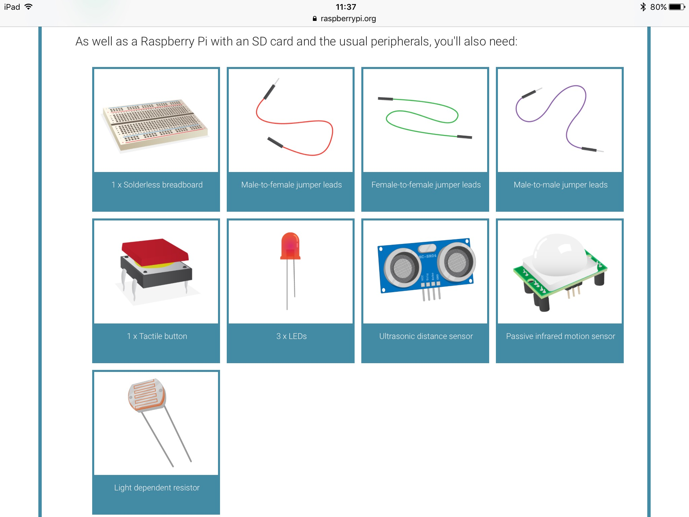

My plans for CoderDojo are:

I think we should have a look at the Raspberry Pi's and do some Physical Computing/Coding with python. I also think we should make a cool badge with Micro: 
Bit's, I have used these before at school and I've made a Micro: Bit controlled car and I will attach all the instrucions, hardware list and images .etc.

www.raspberrypi.org/learning/physical-computing-with-python/

